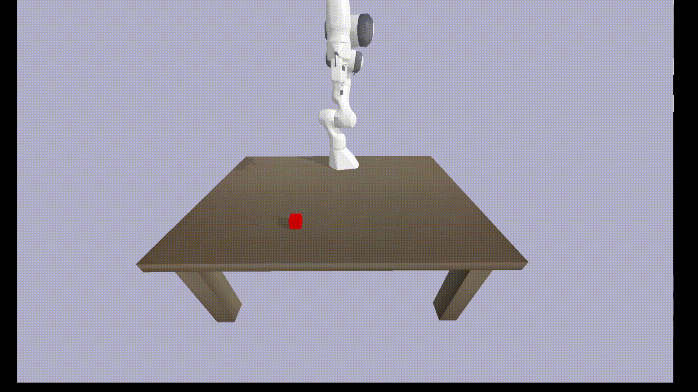

# RT-1-pytorch

This repository contains the implementation of a grasping task based on *["RT-1: Robotics Transformer for Real-World Control at Scale"](https://robotics-transformer1.github.io/)*. The project utilizes the **PyBullet** simulator for both task simulation and data generation and employs **PyTorch** for neural network training and inference

## Demo

## Reference

[pytorch_rt1_with_trainer_and_tester](https://github.com/ioai-tech/pytorch_rt1_with_trainer_and_tester) and [pytorch_robotics_transformer](https://github.com/maruya24/pytorch_robotics_transformer)
